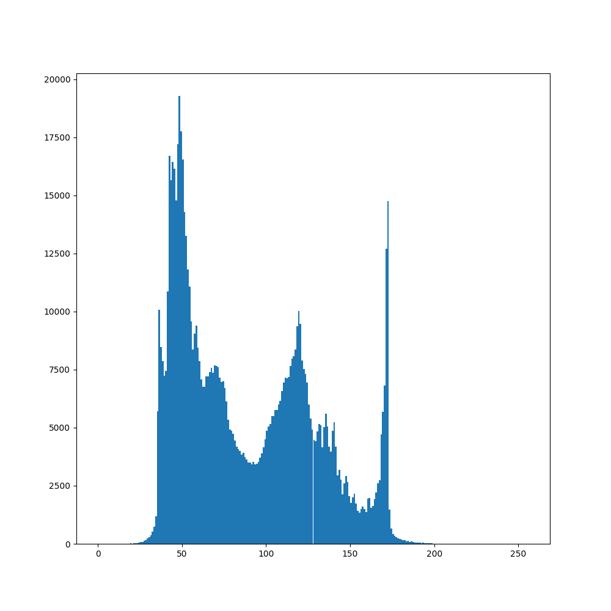
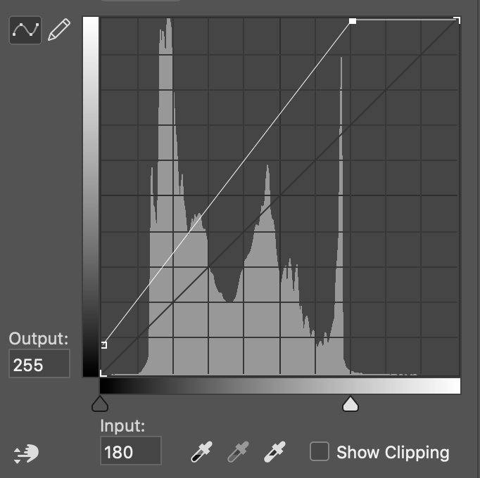
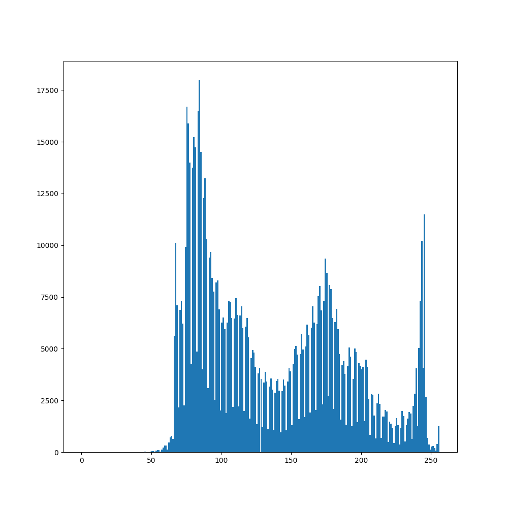
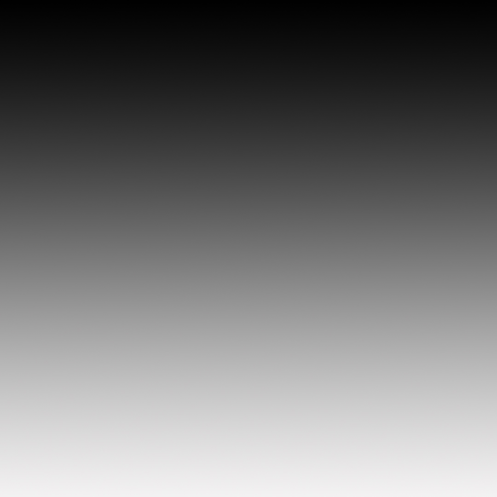
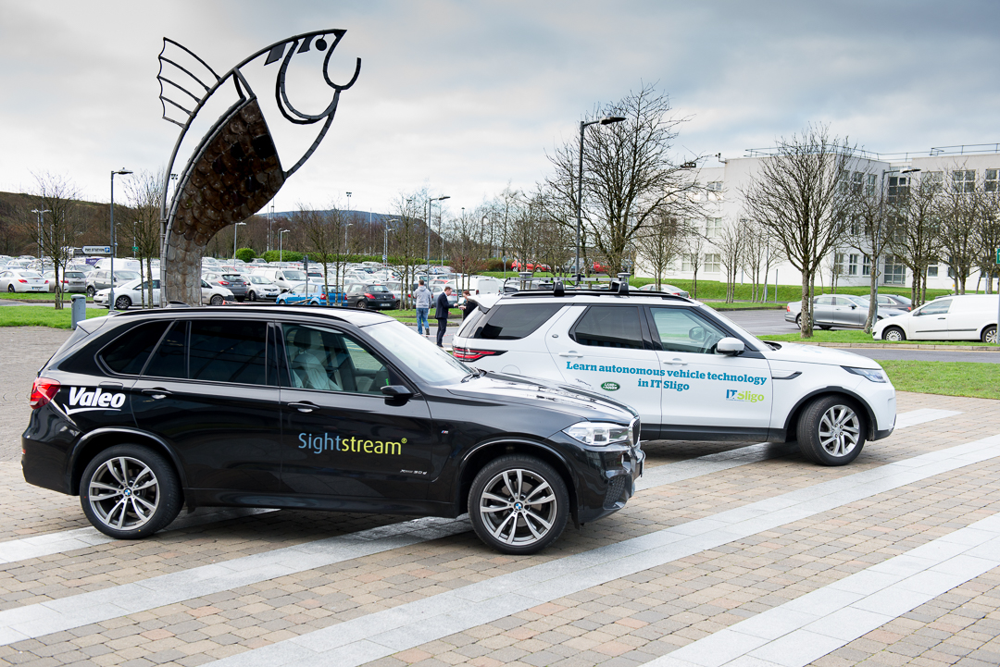
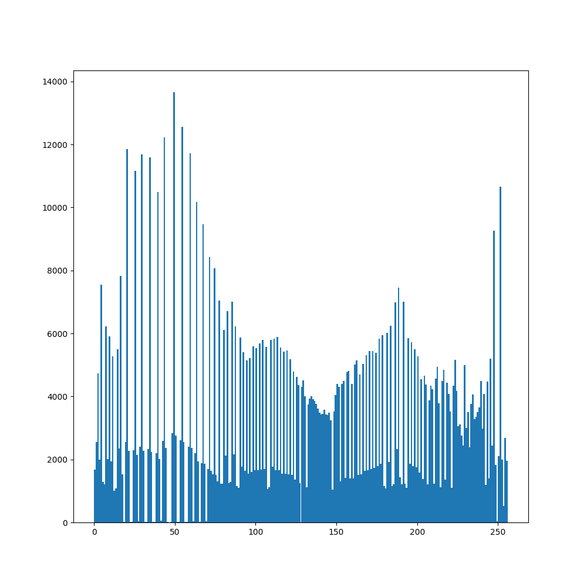

$$ a + b = c $$

:: {.frame}
### Models Vs Reality
:::

::: {.frame}
### Introduction

Why Image Processing? Is this not a Computer Vision module?\
While image processing is a large field in its own right it is generally
considered to be a task that changes an image in some way for the sake
of the human viewer.\
However, in many cases it is also the first stage of computer vision
applications.\
It is generally thought of as a pre-processing step which modifies the
image in such a way as to make it more suitable for computer analysis.
:::

::: {.frame}
### Point operators or point processes

##

The simplest of image processing operators are the point operators.
These are operators that manipulate or change each pixel in an image
independently of the pixels around it (referred to as neighbours).
Examples:\

-   Brightness adjustment.\

-   Contrast adjustment.\

-   Colour correction.\

-   Colour transforms.
:::

::: {.frame}
### Operator

An operator in image processing is a function which takes a pixel value
and produces a new pixel value.\
$$g(\vec{x}) = h(f(\vec{x}))$$

Usually for an image (in the continuous domain),\
$\vec{x} \in \mathbb{R}^2$ if it is a grey scale image\
and $\vec{x} \in \mathbb{R}^3$ for a colour image.
:::

::: {.frame}
### Operator

When we deal with digital images we move from
$\mathbb{R} \to \mathbb{Z}$.\
This means that digital images are discrete(sampled) images, and each
pixel has a location in a 2D plane. $\vec{x}=(i,j)^\top$\
and therefore $g(i,j) = h(f(i,j))$.\
$f$ and $g$ are images, and $h$ is the pixel transformation from
$f \to g$.
:::

::: {.frame}
### Transformations

Let's look at an example transformation.

$$ g(\vec{x}) = af(\vec{x}) + b $$

What will this do?
:::

::: {.frame}
### Transformations

$af(\vec{x})$ will multiply each pixel brightness value by $a$.\
While $+b$ simply adds a constant brightness value $b$ to each pixel.\
$a$ would often be called gain and $b$ bias.\
You may also notice that this is the equation of a line with y-intersect
$b$ and slope $a$.\
So you could graph this function against the input pixel brightness
range to see what value of the output pixel brightness value will be.
:::

::: {.frame}
### $g(\vec{x}) = af(\vec{x}) + b$
![image]{/images/histoAffine20-180t.png}

  ------------------------------------------------------------- -------------------------------------------------------------- ----------------------------------------------------------
        {width="\\textwidth"}    {width="\\textwidth"}
   {width="\\textwidth"}   {width="\\textwidth"}  
  ------------------------------------------------------------- -------------------------------------------------------------- ----------------------------------------------------------

\
:::

::: {.frame}
### Saturation

A word of warning though.\
Digital images have a minimum and maximum brightness.\
The above may be a linear function (strictly speaking Affine function)
but once the output reaches the maximum value allowed in the digital
image then it cannot go any brighter.\
This is important for two reasons.\
Firstly, we lose any information that hits this maximum value, so later
computer vision algorithms may not be able to do anything with it.
Secondly, the operation becomes irreversible.\
If you have stayed within the range this operation can be reversed by
$$f(\vec{x}) = \frac{g(\vec{x}) - b}{a}$$\
note the order of operations, the subtract must take place first, and
then the division.
:::

::: {.frame}
### Reversible?

Also note that in a digital image, operations are rarely perfectly
reversible even if the maths says they should be.\
We regularly end up with floating point values that must be re-quatized
to discrete values.\
The same will happen during the reverse operation but it cannot undo the
original re-quantization instead it will just add its own.\
Therefore repeated operations will cumulatively add quantization noise.\
This is something to always keep in mind when performing image
processing calculations.\
**Pro-Tip:** If possible, do all image processing operations without
converting to discrete values in between.
:::

::: {.frame}
###

Consider the following function:

$g(\vec{x}) = a(\vec{x})f(\vec{x}) +b(\vec{x})$

Now both $a$ and $b$ are functions of $\vec{x}$ instead of just constant
values, which means that their value varies depending on position.\
What are the functions $a()$ and $b()$?\
Well they are not defined here, so they could be anything.\
Consider a graduated filter.
:::

::: {.frame}
### Graduated Filter

  ---------------------------------------------------- ----------------------------------------------------------- ------------------------------------------------------
   {width="\\textwidth"}   {width="\\textwidth"}   {width="\\textwidth"}
  ---------------------------------------------------- ----------------------------------------------------------- ------------------------------------------------------
:::

::: {.frame}
### Operations combining two images.

Consider the following function.
$$g(\vec{x}) = (1-\alpha)f_0(\vec{x}) + \alpha f_1(\vec{x})$$

This will blend two images into one, taking $\alpha$ times the
brightness of image $f_1$ and $(1-\alpha)$ times the brightness of image
$f_0$.\
$\alpha$ is in the range $[0,1]$\
And of course $\alpha$ could be a function of $\vec{x}$ so we would
blend differently at different positions in the image.\
:::

::: {.frame}
### Non-linear Point operations

Let's look at a non-linear point operation.
$$g(\vec{x}) = [f(\vec{x})]^{\gamma}$$ $f(\vec{x})\in[0,1]$\
This operation is usually referred to as gamma correction.\
Which suggests that it is correcting for something.\
In most camera systems the mapping from input radiance to quantized
pixel values is a non-linear one.\
Gamma correction can be applied later to undo this.\
A $\gamma = 2.2$ will suit well for most digital cameras.\
Screens and monitors also undergo some gamma correction and you can
usually play with this in the settings of the monitor.
:::

::: {.frame}
###  Colour Transforms

Consider an RGB (Red, Green, Blue) image.\
We could consider these to be three separate gray scale images
$r(\vec{x})$, $g(\vec{x})$ and $b(\vec{x})$.\
If we decide to brighten each of these individually by the same amount
and then recombine them, we may get a nasty surprise.\
As well as brightening we may get quite a bit of colour drift.\
Colours may change in an unnatural way.\
E.g. Skin tones may appear unnatural.\
:::

::: {.frame}
###  Colour Transforms

The problem we have encountered is that colour channels are highly
correlated with each-other, so treating them independently can have poor
consequences.\
The better option here would be to try to separate brightness from
colour. e.g. YUV, YIQ or CIE-L\*a\*b\*. which single out the brightness
value as Y or L respectively.\
We would then only apply the brightness change to the
brightness/luminance channel and then reconvert to RGB giving a better
result.\
Note of Caution: some libraries use BGR, so if you notice the colour
looks odd then this should be your first place that you look for a
solution.
:::

::: {.frame}
###

We may of course want to change the colours of an image.\
Most often in pre-processing this would take the form of colour balance
corrections.\
A problem exists that different light sources have a different colours.\
Sunlight is quite blue in tone.\
Fluorescent, LED, camera flash, tungsten all have different colours.\
Many digital cameras allow you to set this in camera or the camera will
try to guess.\
:::

::: {.frame}
###

In many cases there are competing light sources in an image and a single
correction is not globally effective.\
In these cases we would like uniform gray parts of the image to be gray
and white parts to be white.\
There are many algorithms for doing this from individually modifying
each of the channels separately to converting to a colour space that
separates out colour and then making global changes that move gray parts
of the image to values in that space that have zero colour.\
Every other pixel moves in the same direction.\
Then convert back to RGB.
:::

::: {.frame}
### Colour Conversions

If you want to convert from Colour to YIQ\
Let's assume we have the following values RGB values\
R = 126, G=120, B=200\
The Matrix $C$ is a linear transformation from RGB to YIQ.\

  ---------------------------------------------------- --

                 $$C = \begin{bmatrix*}[r]             
                    0.299       & 0.587  & 0.114 \\    
                   0.596       & -0.274  & -0.322  \\  
                   0.211        & -0.523   & 0.312     
                          \end{bmatrix*}$$             
                   with RGB values of                  
  ---------------------------------------------------- --

\
:::

::: {.frame}
### Colour Conversions

$$C\vec{p}_{rgb}=\vec{p}_{yiq}$$

$$\vec{p}_{yiq} = \begin{bmatrix*}[r]
                0.299       & 0.587  & 0.114 \\
                0.596       & -0.274  & -0.322  \\
                0.211        & -0.523   & 0.312  
            \end{bmatrix*}
            \begin{bmatrix*}[r]
            126       \\
            120        \\
            200         
            \end{bmatrix*} =
            \begin{bmatrix*}[r]
            131       \\
            -22        \\
            26         
            \end{bmatrix*}$$
:::

::: {.frame}
### Compositing and Matting

Matting refers to extracting an object from an image.\
Compositing refers to inserting this object into another image without
noticeable artefacts (i.e. it should not be obvious that it was not part
of the original image).\
Blue/Green screens are often used to make this process easier.\
Some terms to be familiar with here are foreground, background and
$\alpha$ (alpha).\
Usually we talk about the foreground as being the object that is matted
from the background of one image and composited into the background of
another image.
:::

::: {.frame}
### Compositing and Matting

$\alpha$ is a fourth channel that is added to our three-channel image
(e.g. RGB). $\alpha \in [0,1]$ is the transparency/opacity at each
pixel.\
So in an $\alpha$-matted image a pixel that is definitely in the
foreground object we want to take has an $\alpha=1$ (fully opaque).\
Pixels that are definitely outside the object, i.e. background have
$\alpha=0$ (fully transparent).\
When the boundary of the foreground object with background is not
distinct (e.g. a hair that is thinner than a pixel) then $\alpha$ is
between 0 and 1.\
:::

::: {.frame}
### Compositing and Matting

Then to composite the object onto a new background image we use the
following equation, called the over-operator.
$$C = (1-\alpha)B + \alpha F.
    \label{over-operator}$$

Where B is background and F is foreground.\
Depending on the application we sometimes pre-multiply $\alpha F$ and
store in the $\alpha$-matted image.\
In other cases this is left until later.\
There are other functions other than the over-operator
[\[over-operator\]](#over-operator){reference-type="eqref"
reference="over-operator"}.\
But this will suffice for now.
:::

::: {.frame}
### Contrast Stretching.

The brightness and gain mentioned earlier are useful but require human
judgement. In Computer Vision we must always consider if values can be
automatically determined by some mechanism.

Contrast stretch is one option here. It aims to make the most use of the
dynamic range available. e.g. in an 8-bit image
$[0,255] \rightarrow{[v_{min},v_{max}]}$. Find the darkest pixel in the
image, $u_{min}$. Find the brightest pixel called $u_{max}$. Now change
$u_{min}$ to match $v_{min}$ and $u_{max}$ to match $v_{max}$ and
stretch every other pixel linearly between those two points.

$$T(u) =
            \begin{cases}
            v_{min} & \text{if } u<u_{min}\\
            v_{min}+\frac{(v_{max} - v_{min})(u-u_{min})}{u_{max}-u_{min}} & \text{if } u_{min}<u<u_{max}\\
            v_{max} & \text{if } u>u_{max}
            \end{cases}$$
:::

::: {.frame}
### Histogram Equalisation.

We can take this idea to its logical extreme. I.e. that we should have
the same number of pixels of each brightness value and that the
resulting image should have a histogram that is flat from $v_{min}$ to
$v_{max}$. To calculate how to do this we need to start with the
histogram of the original image which we will call $h(i)$ where $i$ is
the brightness value. We can then borrow a common function from
statistics, the cumulative distribution $c(I)$
:::

::: {.frame}
### Cumulative Distribution

$$c(I) = \frac{1}{N}\sum_{i=0}^I h(i) = c(I-1)+\frac{1}{N}h(I),$$ N is
the number of pixels in the image. For a given brightness value $i$ we
can look up its corresponding percentile $c(I)$ and from this determine
the final value the pixel should take. Both $I,c \in [0, 255]$ for an
8-bit image. i.e. if $M=256$
$$c(I) = \frac{M}{N}\sum_{i=0}^I h(i) = c(I-1)+\frac{M}{N}h(I),$$ Note
that the result will be real numbers $\in [0,M-1]$ and will have to be
requantized to integers $\in [0,M-1]$ and this will lead to some
roughness in the final histogram.
:::

::: {.frame}
### Histogram Equalisation

  ------------------------------------------------------------ ------------------------------------------------------------ --
   {width="\\textwidth"}   {width="\\textwidth"}  
    {width="\\textwidth"}     {width="\\textwidth"}   
  ------------------------------------------------------------ ------------------------------------------------------------ --

\
:::

::: {.frame}
### Linear Filtering

The logical progression from point operators is to use multiple pixels
to produce the "processed\" output pixel.\
This normally takes the form of using a neighbourhood of pixels to
produce the output pixel.\
$n\times n$ where $n$ is an odd number are the normal shape of these,
i.e. symmetrical around the pixel with $3\times3$ being the smallest
possible ($1\times1$ is just a point operator).
:::

::: {.frame}
### Linear Filtering

As the name suggests, these are linear operations which means that the
order in which they occur doesn't matter and they obey all the other
rules of linearity such as homogeneity and additivity.\
Once again this is only in the pure mathematical sense.\
We break linearity if the result at any point drops outside the range of
our min/max values.\
And when our pixel is an edge pixel we get non-linear effects so it
works differently than a pixel that is in the internal of the image.\
Note that for an $n\times n$ operator, an edge pixel is any pixel within
$(n-1)/2$ of the edge and every pixel closer to the edge the further
from the linear operation we get.
:::

::: {.frame}
### Correlation operator.

$$g(i,j)=\sum_{k,l}f(i+k, j+l)h(k,l)$$

$$g=f \otimes h$$ With $h(k,l)$ being the filter coefficients.\
:::

::: {.frame}
###  Convolution operator.

$$g(i,j)=\sum_{k,l}f(i, j)h(i-k,j-l)$$

$$g=f \ast h$$ With $h(k,l)$ being the filter coefficients.\
:::

::: {.frame}
### Point Spread Function (PSF)

If you've taken a class in DSP you can think of $h(k,l)$ as a
two-dimensional impulse response.\
In image processing this is more commonly called a PSF (Point Spread
Function).\
Convolution/correlation, in addition to being a linear operator is also
shift invariant (subject to the usual assumptions which we will no
longer continue to state but should always be aware of).\
Think of this as the operator behaves the same no matter where it is in
the image.
:::

::: {.frame}
### Border Effects

What should we do with the situation where the filter goes off the edge
of the image?\
There are many solutions, none of which are right or wrong, just
different ways of dealing with a problematic situation.\
:::

::: {.frame}
### Border Solutions

We could pad the image with zeros on the edges. The number of border
pixels we would need to add is $(n-1)/2$.\
Or set all those pixels to some value other than zero.\
Clamp: just duplicate the nearest edge pixel, making up a border that
way.\
Cyclic: Wrap, repeat or tile: loop around the image. i.e. if you go off
the top you come back on at the bottom, same left for right.\
Like computer games in the 70/80s.\
Mirror: reflect pixel values across the edge.\
Extend: extend the signal by subtracting the mirrored version of the
signal from the edge pixel value.
:::

::: {.frame}
### Linear Filter Examples:Blurring

Why would we want to blur an image?\
Well one common reason is to reduce noise in an image.\
As the noise changes from one pixel position to another then if we
average over several pixels it will reduce the noise.\
It has an obvious problem however, edges in the image will also be
blurred.\
So this is a compromise but some types of averaging are better than
others.\
Let's look at a poor one first. A box filter.\
:::

::: {.frame}
### Box Filter

This can also be shown as     $1/9$\

This is averaging at its most basic.\
Take the current pixel and the eight surrounding neighbours, add up the
sum of these pixels and divide by nine (as there are nine pixels
altogether).
:::

::: {.frame}
### Weighted Average

This next one gives the higher priority to the centre pixel and less to
the others.\
$1/10$\
And there are lots of configurations of these.\
This one is called the bilinear. $1/16$\
:::

::: {.frame}
### Gaussian

Then there is the approximation of a Gaussian, which isn't much use as a
$3\times3$ but this $5\times5$ is quite useful.\
$1/256$\
:::

::: {.frame}
### Horizontal and Vertical Sobel

::: {.TAB}
(e,1cm,1cm):c:c:c::c:c:c: $-1$ & $-2$ & $-1$\
$0$ & $0$ & $0$\
$1$ & $2$ & $1$\
:::

        

::: {.TAB}
(e,1cm,1cm):c:c:c::c:c:c: $-1$ & $0$ & $1$\
$-2$ & $0$ & $2$\
$-1$ & $0$ & $1$
:::

\
:::

::: {.frame}
### Laplacian

There are many different approximations of the laplacian, this is just
one common one. It is trying to achieve the partial second derivatives
in the x and y directions:\
$$\nabla^2B\equiv\frac{\partial^2B}{\partial x^2}+\frac{\partial^2B}{\partial y^2}$$\
:::

::: {.frame}
### Non-linear neighbour operators

Not all noise has a gaussian or uniform distribution.\
Shot noise for example, is noise where there are occasionally very large
values.\
By very large we mean well outside the range of the standard deviation
of gaussian noise.\
Regular blurring with a gaussian filter will make a change here but the
one large pixel value will cause problems as it will overpower values
close by.\
Rather than being removed it widens them and does bring them down in
value but they are still visible.
:::

::: {.frame}
### Non-linear neighbour operators

Rather than use the mean of the set of pixels withing the receptive
field of the filter we should instead get the median.\
This can be slow to compute although algorithms exist to mitigate this
somewhat.\
For shot noise it works well but it is not efficient at averaging away
Gaussian noise.\
To combine the two a filter called the $\alpha$-trimmed mean can be
used.\
This does a mean on all pixels that apart from some fraction $\alpha$ of
the smallest and largest.
:::

::: {.frame}
### The Bilateral Filter

None of the above filters deal well with the situation of an edge in the
image that is legitimately part of the signal.\
What occurs is that such edges are smoothed by the pixels close to them
and we get the average along the edge rather than a sharp
discontinuity.\
The Bilateral Filter is a little like the $\alpha$-trimmed mean, but in
this case they reject pixels, whose intensity differs too much from the
central pixel.\
So we smooth/average pixels that are close in value to the central pixel
and by close we mean with some standard deviation of the pixel
intensity.
:::

::: {.frame}
### The Bilateral Filter Function

$$g(i,j) = \frac{\sum_{k,l}f(k,l)w(i,j,k,l)}{\sum_{k,l}w(i,j,k,l)}$$ The
weighting coefficient $w(i,j,k,l)$ is complex and needs to be broken
down in to constituent parts. It's the product of a domain kernel
$$d(i,j,k,l)=exp\left(-\frac{(i-k)^2+(j-l)^2)}{2\sigma^2_d}\right)$$ and
a range-kernel.
$$r(i,j,k,l)=exp\left(-\frac{||f(i,j)-f(k,l)||^2}{2\sigma^2_r}\right)$$
:::

::: {.frame}
### The Bilateral Filter Function

When multiplied together, these yield the data-dependent bilateral
weight function.
$$w(i,j,k,l)=exp\left(-\frac{(i-k)^2+(j-l)^2)}{2\sigma^2_d}-\frac{||f(i,j)-f(k,l)||^2}{2\sigma^2_r}\right)$$
:::

# Geometric Transformations

So far, all we have done is to make changes to the range of an image.
i.e. We change the intensity values of the image. But we can also move
pixels from one place to another.\
Some general examples:

-   Rotation

-   Warping

-   Enlarge/Reduce

Mathematical Characterisation:

-   Translation $\to$ preserves orientation, length, angles,
    parallelism, straight lines.

-   Rigid (Euclidean)$\to$ preserves length, angles, parallelism,
    straight lines.

-   Similarity $\to$ preserves angles, parallelism, straight lines.

-   Affine $\to$ preserves parallelism, straight lines.

-   Projective $\to$ preserves straight lines

## Translation

The matrix for this is

   $$\begin{bmatrix*}[r]
                1      & 0  & t_x \\
                0       & 1  & t_y  \\
                0        & 0   & 1  
            \end{bmatrix*}$$

or

   $$\begin{bmatrix*}[r]
                I& t \\
                \textbf{0}^T       & 1
            \end{bmatrix*}$$

or

$$[ \ \textbf{\textit{I}} \ | \ \textbf{\textit{t}} \ ]_{2\times3}$$

Example: take the pixel at position $(2,3)$ and translate it 5 pixels on
the x-axis and 4 pixels on the y-axis.

   $$\begin{bmatrix*}[r]
                1      & 0  & 5 \\
                0       & 1  & 4  \\
                0        & 0   & 1  
            \end{bmatrix*}
            \begin{bmatrix*}[r]
                2\\
                3  \\
                1   
            \end{bmatrix*}
            = \begin{bmatrix*}[r]
                7\\
                7  \\
                1   
            \end{bmatrix*}$$

## Rigid

The matrix for this is

   $$\begin{bmatrix*}[r]
                \cos\theta      & -\sin\theta  & t_x \\
                \sin\theta       & \cos\theta  & t_y  \\
                0        & 0   & 1  
            \end{bmatrix*}$$

or

   $$\begin{bmatrix*}[r]
                \textbf{\textit{R}}& \textbf{\textit{t}} \\
                \textbf{0}^T       & 1
            \end{bmatrix*}$$

or

$$[ \ \textbf{\textit{R}} \ | \ \textbf{\textit{t}} \ ]_{2\times3}$$

## Similarity

The matrix for this is

   $$\begin{bmatrix*}[r]
                s \cos\theta      & -s \sin\theta  & t_x \\
                s \sin\theta       & s \cos\theta  & t_y  \\
                0        & 0   & 1  
            \end{bmatrix*}$$

or

   $$\begin{bmatrix*}[r]
                s\textbf{\textit{R}}& \textbf{\textit{t}} \\
                \textbf{0}^T       & 1
            \end{bmatrix*}$$

or

$$[ \ s\textbf{\textit{R}} \ | \ \textbf{\textit{t}} \ ]_{2\times3}$$

Where $s$ is the scale factor.

## Affine

The matrix for this is

   $$\begin{bmatrix*}[r]
               a_{11}     & a_{12}  & t_x \\
                a_{21}       & a_{22}  & t_y  \\
                0        & 0   & 1  
            \end{bmatrix*}$$

or

   $$\begin{bmatrix*}[r]
                \textbf{\textit{A}}& \textbf{\textit{t}} \\
                \textbf{0}^T       & 1
            \end{bmatrix*}$$

or

$$[ \ \textbf{\textit{A}} \ \textbf{\textit{t}} \ ]_{2\times3}$$

Where $s$ is the scale factor. Using Singular Value Decomposition
$\textbf{\textit{A}}$ can be broken down into
$\textbf{\textit{A}} = \textbf{\textit{R}}(\theta)\textbf{\textit{R}}(-\phi)\textbf{\textit{D}}\textbf{\textit{R}}(\phi)$
where $$D= \begin{bmatrix*}[r]
               \lambda_1    & 0  \\
                0       & \lambda_2
            \end{bmatrix*}$$ In words, rotate ($\phi$) so as to line up
it's Eigen vectors with the x-y axis. Scale it by the $\lambda_1$ in the
x direction and by $\lambda_1$ in the y direction. Now rotate it back
($-\phi$) to the original angle and then rotate to the desired angle
($\theta$).

## Projective

The matrix for this is

   $$\begin{bmatrix*}[r]
               h_{11}     & h_{12}  & h_{13} \\
               h_{21}     & h_{22}  & h_{23}  \\
               h_{31}     & h_{32}  & h_{33}      
            \end{bmatrix*}$$

or

$$[ \ \textbf{\textit{H}}  \ ]_{3\times3}$$

## Going forwards or backwards?

It seems to make sense that whatever our transformation, we would take
each input pixel coordinate, transform it with the matrix to find it's
destination in the new image and transfer the brightness to there. This
has problems though. Due to quantization and other effects we are not
guaranteed to fill every position in the new image. This can leave gaps.
The better plan is to start with a coordinate in the output image.
Determine where its pixel should be coming from in the input image and
copy that over. This way we get no gaps.\
To calculate where an output pixel comes from in the input image you
must calculate the inverse of the matrix and multiply that by the output
coordinate vector and this will give you the input coordinate vector.\
